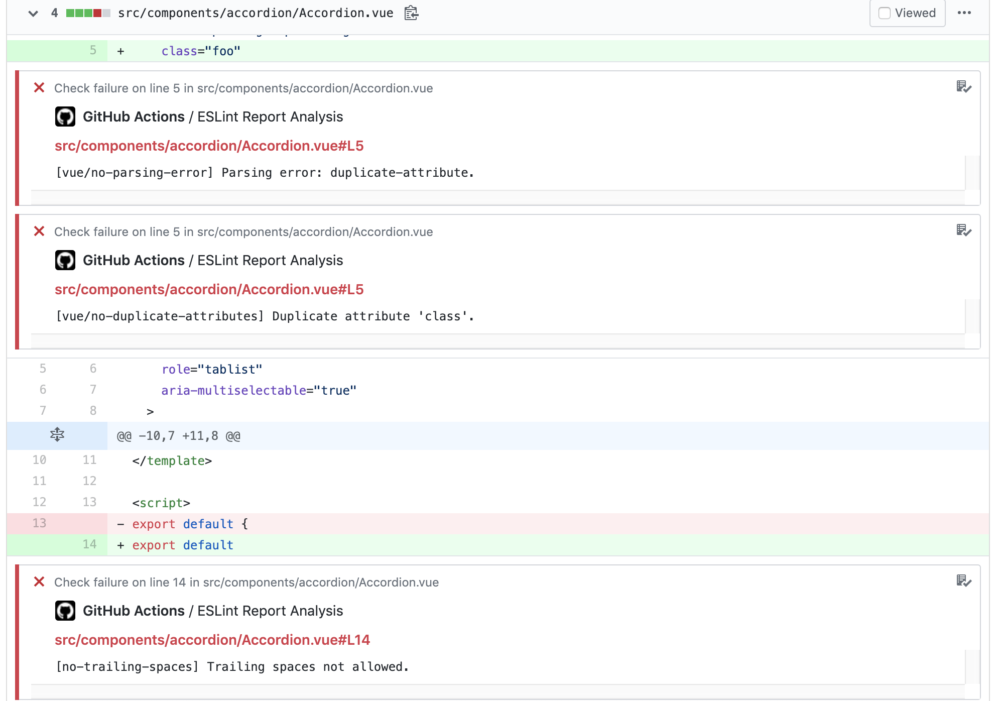
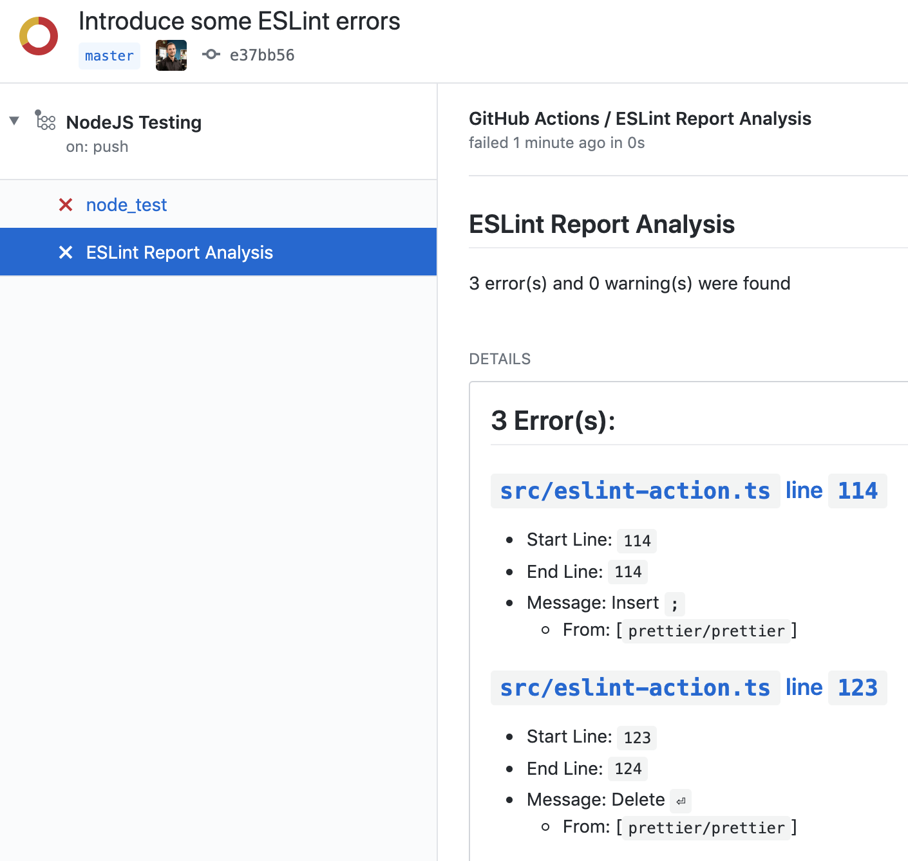

# ESLint Annotate from Report JSON

## Version `2.1.1`

## Description

Analyzes an ESLint a report JSON file and posts the results.

On `pull_request` annotates the pull request diff with warnings and errors



On `push` creates a `ESLint Report Analysis` with a summary of errors and warnings, including links to the line numbers of the violations.



## Why another ESLint action?

The others I tried to use ran ESLint in NodeJS themselves. With this action, I can take an ESLint report generated from the command line and process the results.

This allows for more flexibility on how ESLint is run. This action is agnostic enough to handle different configurations, extensions, etc. across projects without making assumptions on how ESLint should be run.

## Inputs

| Name | Description | Required | Default Value |
|---|---|---|---|
| `repo-token` | The [`GITHUB_TOKEN` secret](https://docs.github.com/en/actions/configuring-and-managing-workflows/authenticating-with-the-github_token#about-the-github_token-secret) | **Yes** | N/A |
| `report-json` | The path to the ESLint report JSON file | No | `eslint_report.json` |
| `only-pr-files` | Only annotate files changed when run on the `pull_request` event | No | `true` |
| `fail-on-warning` | Fail the GitHub Action when ESLint warnings are detected. Set to `true` to enable. | No | `false` |
| `fail-on-error` | Whether to fail the Github action when ESLint errors are detected. If set to false, the check that is created will still fail on ESLint errors. | No | `true` |
| `check-name` | The name of the GitHub status check created. | No | `ESLint Report Analysis` |
| `markdown-report-on-step-summary` | Whether to show a markdown report in the step summary. | No | `false` |

## Outputs

| Name | Description |
|---|---|
| `summary` | A short description of the error and warning count |
| `errorCount` | The amount of errors ESLint reported on |
| `warningCount` | The amount of warnings ESLint reported on |

## Usage Example

In `.github/workflows/nodejs.yml`:

```yml
name: Example NodeJS Workflow

on: [pull_request]

jobs:
  node_test:
    runs-on: ubuntu-latest

    steps:
      - uses: actions/checkout@v3
      - name: Setup Node
        uses: actions/setup-node@v3
        with:
          node-version: 16
          cache: 'npm'
      - name: Install Node Dependencies
        run: npm ci
        env:
          CI: TRUE
      - name: Test Code Linting
        run: npm run lint
      - name: Save Code Linting Report JSON
        # npm script for ESLint
        # eslint --output-file eslint_report.json --format json src
        # See https://eslint.org/docs/user-guide/command-line-interface#options
        run: npm run lint:report
        # Continue to the next step even if this fails
        continue-on-error: true
      - name: Annotate Code Linting Results
        uses: ataylorme/eslint-annotate-action@v2
        with:
          repo-token: "${{ secrets.GITHUB_TOKEN }}"
          report-json: "eslint_report.json"
      # OPTIONAL: save a copy of the usage report for download or use in another job
      # - name: Upload ESLint report
      #   uses: actions/upload-artifact@v3
      #   with:
      #     name: eslint_report.json
      #     path: eslint_report.json
      #     retention-days: 5
